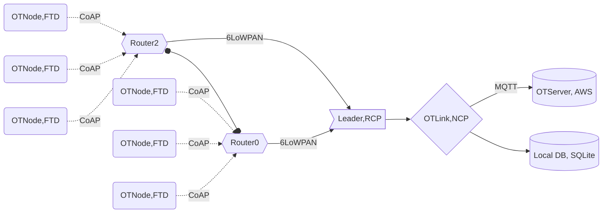

# OTLink 

OTLink is the Raspberry Pi Border Router architecture. It is the part of ThingHz Open thread newtwork. Some of the feature of ThingHz router are

- Bidirectional IP connectivity between Thread and Wi-Fi/Ethernet networks.
- Bidirectional service discovery via mDNS (on Wi-Fi/Ethernet link) and SRP (on Thread network).
- External Thread Commissioning (for example, a mobile phone) to authenticate and join a Thread device to a Thread network.
- Edge device

Raspberry Pi Border Router Architecture



## File Structure

#### Source
```/home/pi/otlink/```

### coapServerCli.py
This is the python script which adds the resource light to coap and then start coap server. After starting the coap server. it appends the PUT payload data to io.txt file.    
```
os.system('sudo ot-ctl coap resource light')
os.system('sudo ot-ctl coap start')
os.system('sudo ot-ctl >> io.txt')
```

### coap_server.sh
This is a bash script which serves the same purpose as the coapServerCli.py
```
sudo ot-ctl coap resource light
echo "starting coap Server"
sudo ot-ctl coap start
sudo ot-ctl >> $FILE_PATH
```

### data_schema.py
This is a python script which handles all the db related crud operations.
```
def createTable(self,table_name)
def dropTable(self, table_name)
def updateTableOnlineIndex(self,id,isOnline,tableName)
def insertIntoDb(self,tableName,device_id,sensor_profile,accel_x,accel_y,accel_z,is_online,time_stamp)
def getMotionData(self,device_id,tableName)
```

## readFile.py
1. This is a python script which reads and "follow tail" of io.txt. 
2. it decodes the content of io.txt from binary to JSON. 
3. appends timestamp to it and send the data to cloud.
4. And keeps the data in local sqlite DB
5. We are keeping the track of data which has been sent successfuly to cloud by adding another column is_online to the DB. is_online=1 means data has been successfuly sent and is_online=0 means error in sending data to cloud 
5. In case of status code != 200 and no internet connection we will insert the data on db with status is_online=0
```
if not res.status_code == 200:
    insertDataToDB(jsonPayload,cust,0)
else:
    insertDataToDB(jsonPayload,cust,1)
def insertDataToDB(motionData,cust,isOnline)
```  

## sendOfflinePayload.py
This is the python script which fetches data with is_online=0 and send the data. data which has been successfuly sent to the cloud is updated in the db mapped according to its id with is_online=1

```
isOfflineData = cust.getOfflineData(isOffline=0,tableName=DB_TABLE_NAME)
if res.status_code == 200:
    cust.beginTransaction()
    cust.updateTableOnlineIndex(id=currentIdOfPayload,isOnline=1,tableName=DB_TABLE_NAME)
    cust.endTransaction()
```

## read_file.service
This is a systemctl service file to run the readFile.py script in background

## coap_server_cli.service
This is a systemctl service file which runs ```coap_server.sh/coapServerCli.py``` script in background

## pi_install.sh
This is a bash scripts which does the following. Run it once on the fresh pi to setup the services
1. starts and enables systemctl coap_server_cli.service
```
sudo install -m 644 coap_server_cli.service /etc/systemd/system/
sudo systemctl enable coap_server_cli.service
```
2. starts and enables systemctl read_file.service
```
sudo install -m 644 read_file.service /etc/systemd/system/
sudo systemctl enable read_file.service
```
3. starts the cron tab every one minute and runs ```sendOfflinePayload.py```
```
CRON_SCRIPT_CMD="1 * * * * /home/pi/otlink/sendOfflinePayload.py"
(crontab -u $(whoami) -l; echo "$CRON_SCRIPT_CMD" ) | crontab -u $(whoami) -
```

4. installs the python dependencies from ```pip3 install -r requirements.txt```


