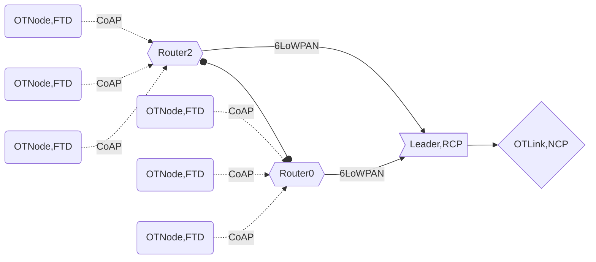

# OTNode Setup
OTNode is open thread Node . Here we have used nrf5280 dongle to configure this Node. We have convidgured it as Full Thread device. This Full Thread device can take following roles
- Router
- End Device
- Router eligible end device.



## Guide to setup NRF52 Dongle for thread implementation

### nrf52 workspace
```motionSenseOpenThread/OTNode/nrfWorkspace/```

### Tools used
GCC ARM Embedded Tool chain to make the example and nRF Connect to flash the firmware

### Steps to setup NRF 52 for Open thread
1. Download [nRFConnect](https://www.nordicsemi.com/Products/Development-tools/nrf-connect-for-desktop) Desktop for flashing the firmware to nrf device and other applications 
2. Download [nRF5 SDK for Thread and Zigbee](https://www.nordicsemi.com/Products/Development-software/nrf5-sdk-for-thread-and-zigbee)
3. Extract the nrf5 SDk and save it at ```~/nrf52/nrf5_sdk_for_thread_and_zigbee_v4.2.0_af27f76```
3. Browse through thread example NR5ThreadSDK/examples/thread and also get familier with the other examples as well.
4. We have different options to compile nrf examples like iar, ses and GCC with Makefile. We will be using GCC to build nrf application.
5. We will be using GCC for compiling and building our thread example for that download [GNU ARM Embedded Toolchain](https://developer.arm.com/downloads/-/gnu-rm) 
6. Extract and save it to ```~/nrf52/gcc-arm-none-eabi-9-2020-q2-update```
7. Next modify the tool chain path go to ```~/nrf52/nrf5_sdk_for_thread_and_zigbee_v4.2.0_af27f76/components/toolchain/gcc/Makefile.posix ```(Makefile.windows in case of windows)
8. Modify ```GNU_INSTALL_ROOT ?= /home/vbshightime/nrf52/gcc-arm-none-eabi-10.3-2021.10/bin/``` (for windows it will be installation directory for gnu tools)

### Guide Compiling, Building and flashing  NRF Examples
1. To understand this we will be going through cli example nrfSDK/examples/thread/cli. project structure would be like this
cli
```
|---main.c
|---mtd //Minimal thread device
|---ftd //Full thread device
    |---uart //UART example
    |---usb //USB example
        |---pca10059 //NRF dongle pca code
            |---mbr 
                |---armgcc //GCC compiling options
                    |---Makefile //GCC Makefile
                    |---thread_cli_ftd_usb_gcc_nrf52.ld //Flash placement file Flash and RAM configure
                |---config
                    |---sdkConfig.h // SDK configuration file
		        |---ses                    
                    |---flash_placement.xml
                    |---thread_cli_ftd_usb_pca10059_mbr.emProject
```
2. go to armgcc directory and type make

3. After successsful compilation you will see _build directory, which contains project hex and bin files

4. open nRFConnect select programme.

5. Press Add Files and then nevigate to _build directory to select project hex file

6. Press the reset button from the nrfDongle to put it in boot mode. selsct the device from the drop down and press write.


### Guide to adapt, build and flash NRF coap, mpu6050 example

1. Clone the ```vibrationAnalysisOpnethread``` directory and nevigate to ```/OTNode/nrfWorkspace/coap_client```

2. The project structure will be like this.

```
|---main.c                                              # main source code
|---mpu6050                         
    |--mpu6050.h                                        # mpu6050 header files
    |--mpu6050.c
|---ftd                                                 # Full thread device
    |---uart                                            # UART example
         |---pca10059                                   # NRF dongle pca code
            |---mbr 
                |---armgcc                              # GCC compiling options          
                    |---Makefile                        # GCC Makefile
                    |---thread_cli_ftd_usb_gcc_nrf52.ld # Flash placement file Flash and RAM configure
                |---config
                    |---sdkConfig.h                     # SDK configuration file
		        |---ses                    
                    |---flash_placement.xml
                    |---thread_cli_ftd_usb_pca10059_mbr.emProject

```

3. Now navigate to ```~/nrf52/nrf5_sdk_for_thread_and_zigbee_v4.2.0_af27f76/examples/thread```
4. create a new directory myprojects
5. copy the contents coap_client folder to ```~/nrf52/nrf5_sdk_for_thread_and_zigbee_v4.2.0_af27f76/examples/thread/myprojects```
6. your path should look like this ```~/nrf52/nrf5_sdk_for_thread_and_zigbee_v4.2.0_af27f76/examples/thread/myprojects/coap_client```
7. Go ```coap_client/ftd/usb/pca10059/mbr/armgcc/Makefile``` and add mpu6050 path here. Then Go to ```coap_client/ftd/usb/pca10059/mbr/armgcc``` and type make
8. After successsful compilation you will see _build directory, which contains project hex and bin files
9. open nRFConnect select programme.
10. Press Add Files and then nevigate to _build directory to select project hex file
11. Press the reset button from the nrfDongle to put it in boot mode. selsct the device from the drop down and press write.


### Pin Mapping nRF Dongle and MPU6050

| Controller |I2C SCL|I2C SDA|VCC|GND|
|---         |---  |---  |---  |---|
|MPU6050   | SCL  | SDA  | VCC  | GND  |
|NRF52 Dongle   | 0.17  | 0.20  | VDD Out  | GND  |

> coap_client example comes with pca10059 configuration. If you want to make pca10056 compatible to pca10059 then use following steps 

### Changes done to make pca10056 compatible to pca10059

in ```/nrfWorkspace/client/ftd/pca10059/armgcc/thread_cli_ftd_usb_gcc_nrf52.ld```
```
MEMORY
{
FLASH (rx) : ORIGIN = 0x1000, LENGTH = 0xdf000
RAM (rwx) : ORIGIN = 0x20000008, LENGTH = 0x3fff8
}
```
in ```/workspace/twi_scanner/pca10059/blank/MakeFile```
```
INC_FOLDERS += \
$(SDK_ROOT)/components/libraries/queue \
$(SDK_ROOT)/components/libraries/cli \
```

### Hex
find hex file ```nrf52840_xxaa.hex``` in ```/workspace/twi_scanner/pca10059/blank/armgcc/_build```
