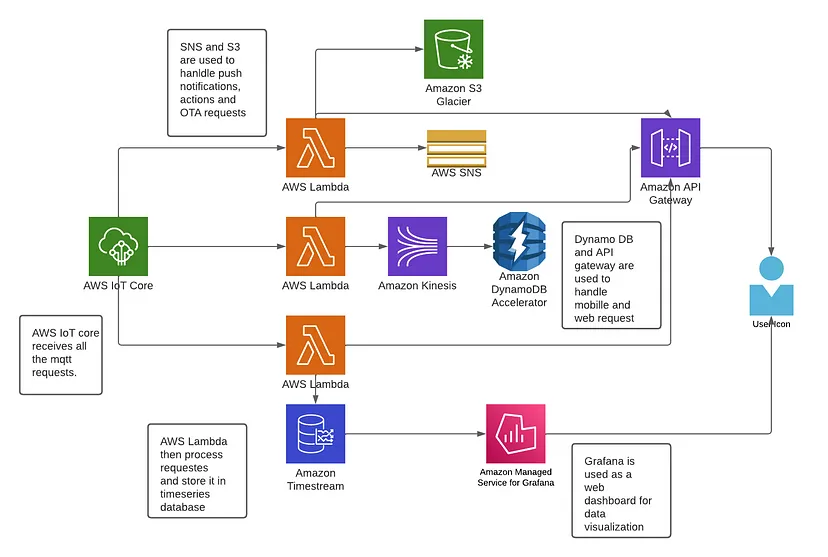
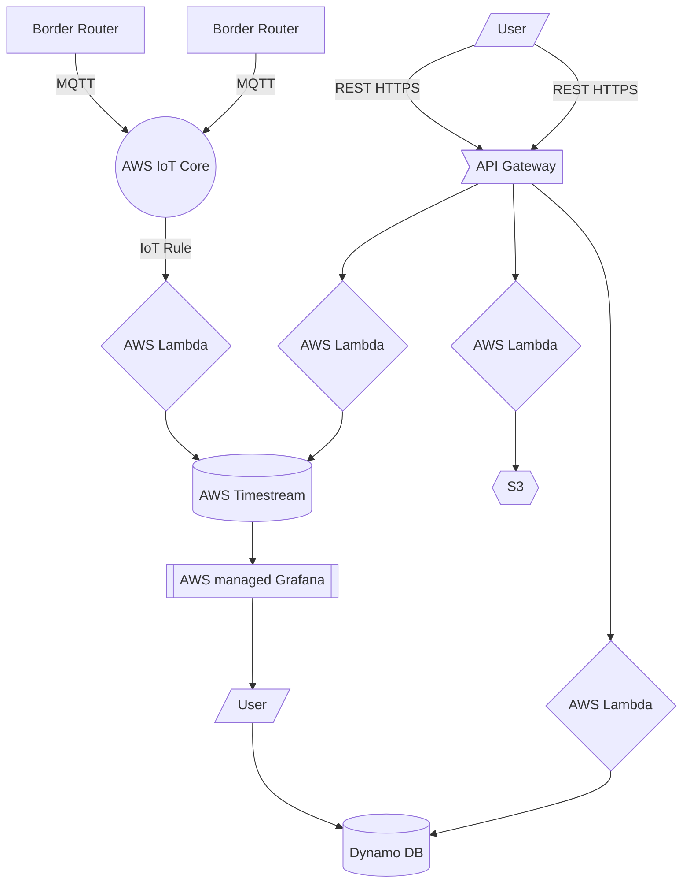

# Openthread AWS infrastructure

## Services used
* AWS IoT Core
* AWS API Gateway
* Dynamo DB
* AWS Lambda

## Development Framework
* Node JS
* Serverless

## Project Report

## Installation guide

### Step1 installing AWS ClI
Install AWS CLI on your windows system from [here](https://docs.aws.amazon.com/cli/latest/userguide/getting-started-install.html#cliv2-windows-install). 
now enter **aws sts get-caller-identity** on your terminal to review your installation and get account information.

### Step2 Setup Node JS
To install NodeJs got o [nodeJs website](https://nodejs.org/en/) and download/install LTS version for your OS type. Review your installation by checking the node version by typing **node --version** on terminal

### Step3 Installing Serverless framework
Serverless is provided as [npm package](https://www.npmjs.com/package/serverless). To install serverless open terminal and type **npm install -g serverless**. To review your installation **serverless -v** to check the node version

### Step4 configure AWS on your system
download AWS Access keys and AWS secret access key form your AWS we console. Then type **aws configure**. Add your access key, secret key, AWS region and output type as **json**.

### Step5 Create application with serverless framework
Create a new project directory and open it in vs code. Now hit **Ctrl+`** to open the terminal. To create your first serverless application template type **serverless create -t aws-nodejs -p otserver** where otserver is the name of the application. This will set up a basic serverless project template for you. in the project template, you can find a serverless.yml file that contains the basic orchestration of projects like permissions, project information, lambda function information and events. There will be another file handler.js which is your main function or code that serves as a lambda function.

### Step6 Installing plugins
#### Install serverless offline
Go inside otserver directory. Install serverless offline from [npm package](https://www.npmjs.com/package/serverless-offline). type **npm i serverless-offline** to install serverless offline.

#### Install serverless pseudo parameters
Go inside otserver directory. Install serverless pseudo parameters from [npm package](https://www.npmjs.com/package/serverless-pseudo-parameters). type **npm i serverless-pseudo-parameters** to install serverless offline.

### Step 7 Deploying your application
To deploy the function in AWS type **serverless deploy -s prod** where prod is the stage name

