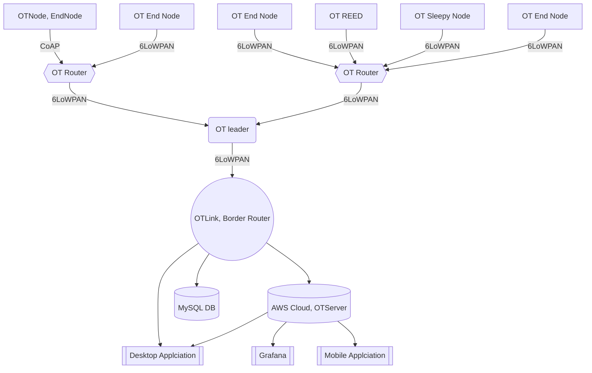

# OpenThread implementation for Industry 4.0
This application contains Openthread implementation for Inductry 4.0. It is an end to end applciation which contains OTnodes , OT borderrouter, Edge device and IoT backend using AWS serverless approach. To know more about Open thread concept you can read this [medium blog](https://medium.com/@vbsmandi/a-deep-dive-into-openthread-optimizing-iot-connectivity-f145a681008a)

This repository contains 3 folders
1. **OTNodes**: These are the open thread end nodes, REED and routers. Navigate to [OTNodes](OTNode) To know more.
2. **OTLink**: This contains Open thread implementation for Border router. This also acts as Edge gateways tp process incoming samples from End nodes. Navigate to [OTLink](OTLink) To know more.
3. **OTServer**: Basically this is IoT backend using AWS serverless. Navigate to [OTServer](OTServer) To know more.

### Configuration, Node Role and Data Flow
- **OTNodes**
    > For this example we are configuring the nodes as Full Thread devices. It means it can work as END device as well as Router eligible end device. You can learn more on OT node in [OTNode](OTNode) folder.  
	
-	**OTLink**
	>	OT Link is the Border router based on Open Thread. Main function of border router is  to manage open thread network, Commision leader and routers, Process nodes data and send processed data to AWS Core. You can learn more on OT node in [OTLink](OTLink) folder.  

- **OTServer**
    >OT Server is AWS Serverless based IoT backend. OT server is responsible for recieving messages from AWS IoT and storing those to AWS Timestream. As a web application we are using Amazon basedMain function of border router is  to manage open thread network, Commision leader and routers, Process nodes data and send processed data to AWS Core. You can learn more on OT node in [OTServer](OTServer) folder.  

## Project FlowChart:
